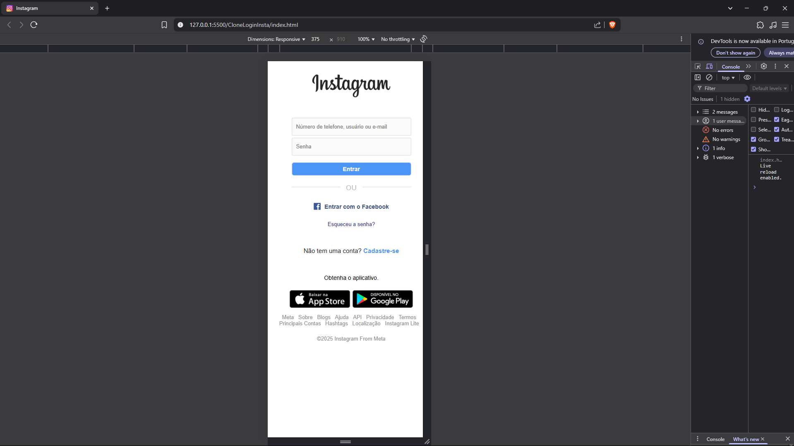

WebCarSales
Este é um projeto simples de formulário para cadastro de veículos, desenvolvido utilizando apenas HTML e CSS. O objetivo principal é proporcionar uma interface limpa e funcional para que usuários possam cadastrar seus carros para venda.

✨ Funcionalidades
Cadastro de informações essenciais sobre o veículo:

Título do anúncio

Preço

Descrição

Marca

Modelo

Quilometragem

Tipo de câmbio (manual ou automático)

Opcionais adicionais

Data da compra

Upload de fotos

Validação básica de campos obrigatórios usando atributos HTML.

Estilo responsivo e limpo com CSS puro, destacando uma boa prática de estruturação e organização visual.

🛠️ Tecnologias utilizadas
HTML5

CSS3

💻 Como visualizar
Clone ou baixe este repositório.

Abra o arquivo index.html diretamente no seu navegador.

Preencha o formulário conforme desejado.

🎯 Objetivo do projeto
Este projeto foi desenvolvido com fins de prática e aprendizado, focando na estruturação de formulários e estilização com CSS, sem utilização de JavaScript ou backend.

📷 Preview

