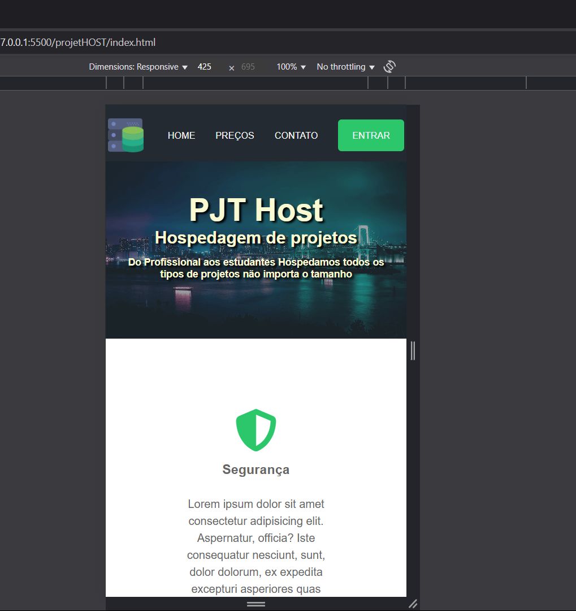
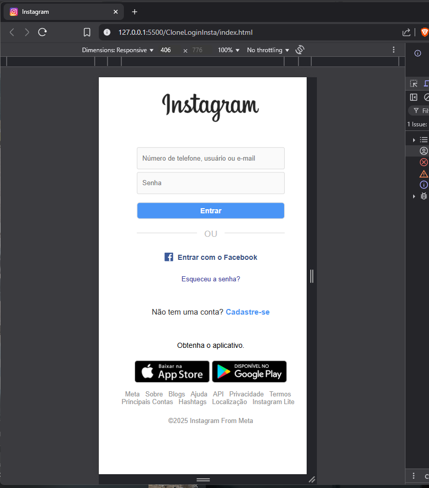

# 📸 Clone da Página de Login do Instagram

Este é um projeto simples de HTML e CSS que reproduz a interface da página de login do Instagram.
O objetivo foi praticar conceitos de estruturação de páginas, estilização responsiva e aprimorar o domínio de Flexbox.

## ✅ Funcionalidades

Layout idêntico à página de login do Instagram.

Responsividade para dispositivos móveis.

Separação clara entre banner e formulário de login.

Estilização moderna e fiel ao design original.

Elementos interativos como "Esqueceu a senha?" e "Entrar com o Facebook".

## 🛠️ Tecnologias Utilizadas

HTML5

CSS3

Flexbox

Media Queries

## 📂 Estrutura do Projeto

    📁 projeto-clone-instagram
    ├── 📁 assets
    │   └── 📁 img
    │       ├── banner2.png
    │       ├── favicon.png
    │       ├── logo_facebook.svg
    │       ├── logo_instagram.png
    │       ├── apple_btn.png
    │       └── gplay_btn.png
    ├── 📁 css
    │   └── style.css
    ├── index.html
    └── README.md

## 🖼️ Layout Responsivo

✅ Desktop: layout com banner à direita e formulário à esquerda.

✅ Mobile: apenas o formulário, com ajustes de largura e espaçamento.

## 🚀 Como Executar

Clone o repositório:

git clone https://github.com/seu-usuario/projeto-clone-instagram.git

Navegue até a pasta do projeto:

cd projeto-clone-instagram
Abra o arquivo index.html no seu navegador.

Obs.: Não há necessidade de backend ou configuração adicional.

## 💡 Aprendizados

Estruturação semântica com HTML.

Estilização com CSS puro.

Criação de layout responsivo com Media Queries.

Uso eficiente do Flexbox para dividir seções.

## 📌 Melhorias Futuras

Adicionar validação de formulário com JavaScript.

Implementar uma versão funcional com backend.

Criar animações para melhorar a experiência do usuário.

# Imagens do projeto

# ✍️ Autor

## Feliph Renaud

Meu LinkedIn: https://www.linkedin.com/in/feliph-renaud-5297b0240/
