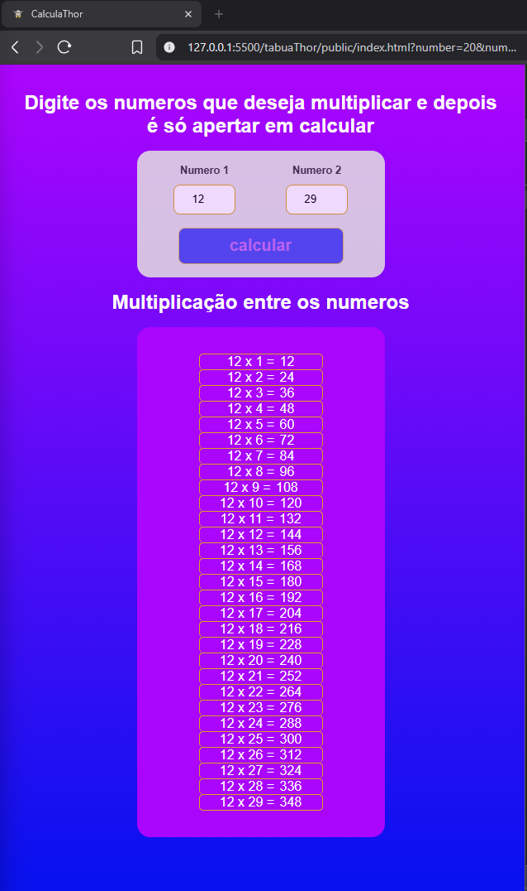

# 🧠 Tabuathor

**Tabuathor**

é um projeto simples e interativo desenvolvido com **HTML, CSS e JavaScript** que permite ao usuário gerar a tabuada personalizada entre dois números fornecidos. Este projeto faz parte do meu portfólio pessoal de estudos em desenvolvimento front-end.

## 🔥 Funcionalidades

- Interface intuitiva para multiplicação de dois números.
- Geração dinâmica da tabuada com JavaScript puro.
- Feedback visual responsivo ao usuário.
- Layout responsivo e estilizado com CSS moderno.
- Prevenção de erros com validação de formulário.
- Separação clara entre lógica (JS), estrutura (HTML) e estilo (CSS).

## 📷 Preview



## 📁 Estrutura de Pastas

    Tabuathor/
    ├── index.html
    ├── src/
    │ ├── css/
    │ │ └── styles.css
    │ ├── js/
    │ │ └── index.js
    │ └── assets/
    │ └── img/
    │ └── pngwing.com.png

## 🚀 Tecnologias Utilizadas

- **HTML5** – Estrutura semântica do formulário e da tabela de multiplicação.
- **CSS3** – Estilização com `flexbox`, gradientes e transições.
- **JavaScript (ES6+)** – Manipulação do DOM, controle de eventos e lógica de multiplicação.

## 🧩 Como funciona?

1. O usuário insere dois números no formulário.
2. Ao clicar em **Calcular**, a página evita o recarregamento usando `preventDefault`.
3. A função `createTable()` gera dinamicamente os resultados da multiplicação e insere no DOM.
4. Cada linha da tabuada é exibida com estilo personalizado.

## 🧪 Código-chave

### JavaScript – Geração da tabuada:

```js
const createTable = (number, multiplicatorNumber) => {
  multiplicationTable.innerHTML = ""

  for (i = 1; i <= multiplicatorNumber; i++){
    const result = number * i

    const template =
    `<div id="row" >
      <div id="operations">${number} x ${i} = </div>
      <div id="result">${result}</div>
    </div>`

    const parser = new DOMParser()
    const htmlTemplate = parser.parseFromString(template, "text/html")
    const row = htmlTemplate.querySelector("#row")
    multiplicationTable.appendChild(row)
  }
}
🛠 Como rodar o projeto
Clone o repositório:


    git clone https://github.com/seuusuario/seurepositorio.git
    cd tabuathor

Abra o arquivo index.html no navegador:

start index.html # Windows
open index.html  # macOS
Ou
apenas clique duas vezes no arquivoindex.html.

 📌 Aprendizados

Este projeto me ajudou a colocar em prática:

Manipulação direta do DOM.

Eventos e formulários com addEventListener.

Criação de templates HTML com DOMParser.

Boas práticas de CSS e responsividade.

💡 Melhorias Futuras
Adicionar validações mais robustas.

Mostrar aviso se os campos estiverem vazios.

Adicionar dark mode.

Exportar a tabuada como .pdf ou .txt.

🙋‍♂️ Autor

Desenvolvido com dedicação por:
 Feliph Renaud
🔗 LinkedIn:
 https://www.linkedin.com/in/feliph-renaud-5297b0240/
📫 Contato: feliph.renaud@gmail.com
```
